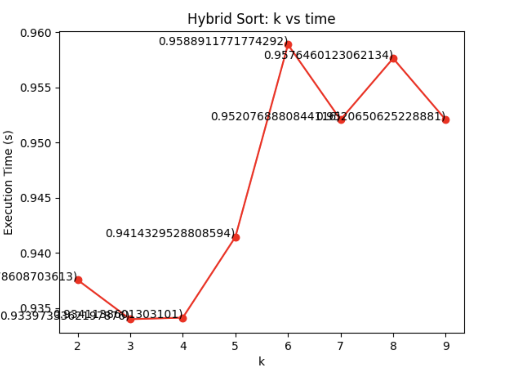

# Q1

## Q1.1

### Implementation

Max Heapify was implemented using both iterative and recursive methods. Each method was used to implement a Build Max Heap. The Verify Max Heap function was used to verify the resulting arrays.

### Results

The iterative and recursive Build Max Heaps were succesfully able to max heapify an array. As expected, the recursive method took longer than the iterative. This is probably due to the overhead created for each recursive call.

Initially, the recursive method was taking longer than the iterative. The was because the recusive method's array2 was being shallow copied from the iterative method's array1. Due to the recursive method being called after the iterative, array2 was already sorted when the recursive method was called, leading to an O(n) runtime.

## Q1.2

**Plateau Valley Sort:**

Assumptions:

1. Sort will run in O(n) time.
2. Even indices will be Valleys.
3. Odd indices will be Plateaus.
4. Iterate from index = 1 (second value) to the end of the array.

Steps:

1. If index is odd

   1. Check if the value to the left (index - 1) is larger.
   2. If it is larger, swap. If not, do nothing.
2. If index is even

   1. Check if the value to the left is less.
   2. If it is less, swap. If not, do nothing.

# Q2.1, Q2.2, Q3.1a-c

Submitted via pdf

# Q3.2

## a

### Implementation

Quicksort and an Optimized Bubble Sort were implemented. Quicksort was implemented recursively, using a randomized pivot for partioning. The Bubble Sort was optimized by adding a swap flag to stop moving through the array in the inner loop if no swap was performed, and continue the outer loop. This allows the optimized bubble sort to have a best case of O(n) if the array is already sorted.

These sorting algorithms were tested using 1M unsorted numbers, and verified using the is_sorted function. The duration for each sort was recorded and printed to the console.

### Results

Quicksort and Optimized Bubble Sort were implemented successfully, its results verified. As expected, the Quicksort ran faster than the Optimized Bubble Sort.

One issue encountered was when trying to use the time efficiency with quicksort. The recursive calls kept causing the times to be printed. To try and solve this, a separate decorator was used in between the time efficiency decorator and the function. However, this did not resolve the issue, maybe due to incorrect implementation. Instead, the start and end times were implemented manually in the main.

## b

### Implementation

Quicksort and Optimized Bubble Sort were combined to create a hybrid sort. This hybrid sort defaults to Quicksort, and leverages Optimized Bubble Sort once the Quicksort subarray reduces to a certain size. The hybrid sort was implemented to go through a range of k, performing each k a certain amount of times, and averaging the runtime for each k. The data was then graphed to show the relation ship between k vs time.

### Results

Quicksort and Optimized Bubble Sort were successfully implemented. In order to find k, the hybrid sort was initially ran over a larger range with higher increments. Once a high level behavior was observed, the window was narrowed, and a small range with increments of 1 were used.

From looking at the graph below, **the best k was determined to be 3**. This value was chosen, as this is where the graph has its lowest point, and time efficiency trends upwards as k diverges from the determined value.

There were some issues encountered during implementation. During the first implementation, the graphs' results were unexpected, with no kind of valley being created. Although one graph was produced that showed a promising valley, the k value was much higher than anticipated. This graph showed a k of 60, while the expected value was between 5-10. Furthermore, the computer being used was fairly fast, so a k on the low end was expected. After analyzing the hybrid sort algorithm, it was noticed that the entire array was being passed into Bubble Sort when k reached or went below the threshold. This was solved by adding low and high indexes to be passed into Bubble Sort, so the proper subarray was being sorted. After fixing this, a k value that better met expectations was found.

