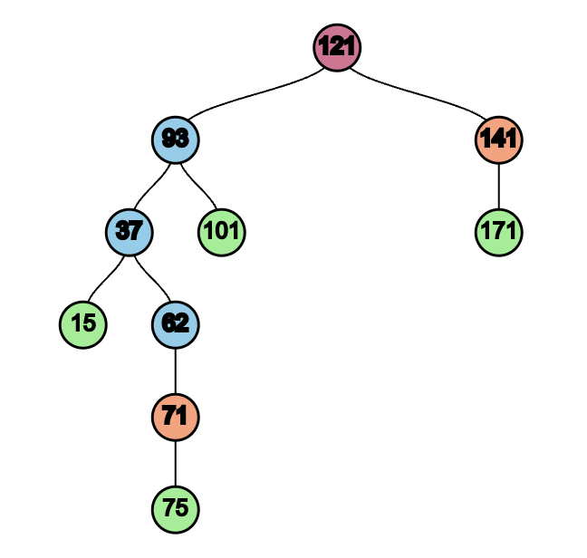
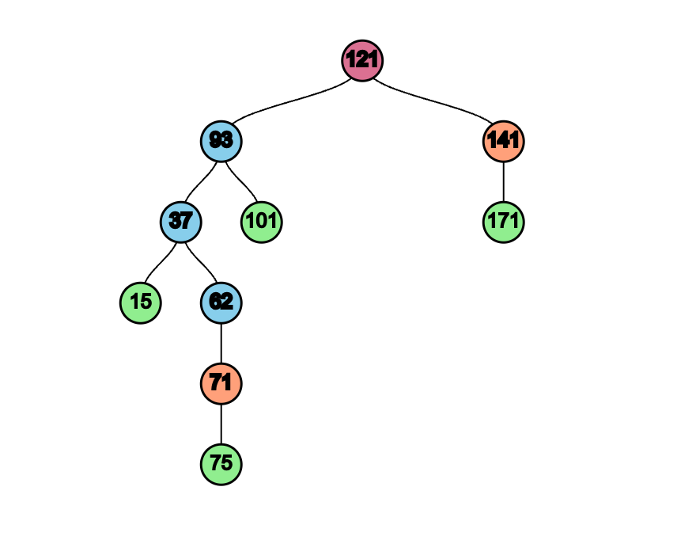

# Q1) Merging *k **sorted* lists into one sorted list (25 points)**

## Psuedocode

In order to merge k sorted lists into one sorted list:

- Initialize new empty sorted list, "sorted"
- Place smallest element of each k sorted lists into a min-heap
- Move top element (smallest) of min-heap to "sorted"
- Replace the element moved to "sorted" with the next value from the k sorted list it was taken from
- Repeat this for each n elements

## Asymptotic Analysis

This meets **O(n log k)** because:

- Inserting an element into a min-heap with height of log k is O(log k)
- Taking the top element from min-heap is O(1)
- A new element is inserted and popped for each of n elements, so total time is O( n(log k + 1) ), which is O(n log k)

## Implementation

### Split 1,000,000 integers into 100 groups of 10,000 integers

- Divide original[ 0 : 999,999 ] into sub-lists so that: sub_list_1[ 0 : 9999 ] ... sub_list_100[ 990,000 : 999,999 ] are generated.

### Sort 50 groups with Radix + Counting Sort

- Sort 50 of the sublists using Radix Sort, with counting sort as the underlying sort for each digit.
- Results in 50 of the 100 sorted sub-lists to merge.

### Sort 50 groups with Bucket sort

- Sort 50 of the sublists uing Bucket sort.
- Results in 50 of the 100 sorted sub-lists to merge.

### Merge 100 groups

- Merge the 100 sorted sub-lists into one sorted list, "sorted", using the algorithm described in the Psuedocode section.

## Discussion: O(n log k) vs O(n k)

After running the merge and sort using O(nlogk) and O(nk) methods, the times are as shown below.

- O(nlogk): ~1.6 s
- O(nk): ~ 6.9 s

In order to decide whether these times are expected or not, an analysis was done based on the asymptotic and recorded time efficiencies.

Assuming the O(nk) method is correct. That's a total time of 6.9 seconds for n=1,000,000 and k=100. Given O(nk), there would be 100,000,000 operations. That gives around 6.9E-8 seconds/operation. So, for an O(nlogk) algorithm, it would take a total time of 6.9E-8 * 1,000,000 * 2, or .138 seconds.

However, when looking at our actual O(nlogk) run time, it took around 1.6 seconds. Although larger than the calculated run time, it is still significantly closer to the calculated run time than the O(nk) run time. Additionally, the run time is expected to be larger than the time run time calculated using the O(nk) method. This is because the O(nlogk) method uses a Min Heap data structure, therefore there is overhead created to maintain the Min Heap and perform its operations.

In conclusion, both the O(nlogk) and O(nk) methods merged k sorted sublists into a sorted array successfuly. Although the O(nlogk) run time was a little higher than expected if looking at the times asymptotically, it is still within reason due to the overhead of the O(nlogk) algorithm.

Looking further, if a faster run time is desired for the O(nlogk) algorithm, one solution is to use Python's heapq library in place of a self-written Min Heap class, as it is written in C and has less overhead.

# Q2) Skip List Performance Experiment (5 points)

## Implementation

### Generate 2 lists of 1,000,000 random integers

- 2 lists were generated with 1,000,000 random integers, "search_in" and "search_for".
- "search_for" contains the values to search for. All of the values will be searched.
- "search_in" is the list to search for these values in.

### Initialize Skip List

- Using ChatGPT, a Skip List class was produced.
- This class contains a method called: "initialize_from_array", which takes in an array to initialize the Skip List.

### Perform Skip List Search

- Using ChatGPT, a batch_search function was created for the Skip List class.
- This method takes in an array, and searches for each of the array values in the skip list.

### Perform Binary Search

- Using ChatGPT, a binary_batch_search function was created.
- This method takes in two arrays, and searches for all the values in arr2 in arr1.
- arr1 is sorted prior to being used as an argument for the binary search.

### Repeat Ten Times

- These steps were repeated ten times, recording the average times to initialize the skip list, search the skip list, sort the array for binary search, and perform the binary search.
- The average times can be found in the Results below.

## Results

## Analysis

Taking a look at the average time efficiencies for the Skip List Search and Binary Search, the desired results were achieved. Both methods aim to achieve O(logn) time efficiencies, with the Skip List Search being the one in question, as more confidence can be placed on the Binary Search's run times. 

Just from looking at the data, the Skip List Search seems to be performing properly, as it is only ~3 seconds slower than the Binary Search. This discrepancy is reasonable, as there is additional overhead in the Skip List Search compared to the Binary Search. And depending on the number of highways, probability of generating a highway, and randomness, more than logn operations could be performed in the Skip List Search. Additionally, if compared to an O(n) time efficiency using Binary Search's O(logn) run time of 1.5 seconds, an O(n) algorithm would take (1.5 / 20) * 1,000,000 seconds, or over 20 hours.

Another drawback of the Skip List is the time it takes to create the Skip List. This took on average 7.52 seconds compared to the average of 0.12 seconds to sort the array for binary sort.

Although the Skip List Search was on average slower than Binary Search, the Skip List data structure still has advantages. A Skip List is able to insert and delete in log(n) time, where an array takes O(n). This makes the Skip List better for dynamic data.

In conclusion, although the Skip List  took a little longer to search than Binary Search. Due to the Skip List Search's runtime's proximity to Binary Search's runtime, especially when comparing it to an O(n) run time, it can be stated that the Skip List Search performed with O(logn) time efficiency. The Skip List takes a little time to initialize, but is great for handling dynamic data.

# Q3) Answer the following BST questions (10 points)

## a) Assign keys to a blank, predetermined BST structure

## b) Describe an algorithm to fill a BST

In order to systematically insert keys into a BST to match a predetermined structure, the BST properties can be used.

1. Sort the keys into ascending order.
2. Do an in-order traversal of the tree (left, root, right).
3. Insert each of the sorted keys at each node.

This works because in-order traversal reads the nodes in ascending order, which matches the sorted keys.

## c) Describe an algorithm to generate key order for a BST

### i)

keys = [ 121, 93, 141, 37, 101, 171, 15, 62, 71, 75 ]

### ii)

In order to generate a key order for a BST to match a predetermined structure, properties used from Part b can be used.

1. Sort the keys into ascending order.
2. Do an in-order traversal of the BST (left, root, right).
3. Map the keys to the node order resulting from the in-order traversal.
   1. For example, a resulting 2x2 array could look like this: [ [key1, node2], [key2, node 1], [key3, node 3] ].
4. Do a level-order traversal of the BST, replacing the node with its mapped key.
   1. The resulting list of keys will be in the correct order.

This works because by mapping the sorted keys to the in-order traversal, each key is correctly assigned to its corresponding node. The level-order traversal gives the nodes in order of insertion. By replacing each of the nodes in the level-order traversal with it's corresponding key, a list of keys with correct insertion order is generated.

## d) Describe why the given BST can't be colored to form a RB Tree

Given the empty BST structure, it is impossible to be converted to a RB Tree due to the height difference between the longest and shortest paths of the BST.

More specifically, the path root->75 has height 5, and root->171 has height 2. This means the longest path's height is more than twice as big as the shortest path's.

This is problematic, because due to red nodes not being able to be placed back to back, the longest path height should be at most: 2 * shortest path height. If the longest path height exceeds this value, the longest path will have a black-height of at least 1 more than the shortest path's black-height. This property also dictates the RBT height: height <= 2 * black height.

Due to this difference in height, there is no way to maintain the black-height rule, no matter how the tree is colored.

## e) Describe rotations and Show final RB Tree

### Rotation Definitions

Right Rotation:

- Use Case
  - When the left side of the root's height exceeds the right side's by more than 1, and balance is desired.
  - Also known as LL imbalance, because the imbalance is due to the node to the left of the node to the left of the subtree's root.
- Action
  - Rotate the root one node to the right so that so that the left child becomes the new root.

Left Rotation:

- Use Case
  - When the left side of the subtree's height exceeds the right side's by more than 1, and balance is desired.
  - Also known as RR imbalance, because the imbalance is due to the node to the right of the node to the right of the subtree's root.
- Action
  - Rotate the root one node to the left so that the right child becomes the new root.

Right-Left Rotation (Double Rotation):

- Use Case
  - When the imbalance is due to the node to the left of the node to the right of the subtree's root (RL imbalance).
- Action:
  - Right Rotate the right child.
  - Left Rotate root.

Left-Right Rotation (Double Rotaation):

- Use Case
  - When the imbalance occurs to the right of the node to the left of the subtree's root, (LR imbalance).
- Action:
  - Left Rotate the left child.
  - Right Rotate the root.

### Convert BST to RB Tree

This BST can not be colored to create a RB Tree for the reasons described in Part d.

To convert the BST to a RB Tree, two rotations will be needed.

The following steps were taken:

Initial BST:

Step 1: Right Rotation on Node 121

Step 2: Left Rotation on Node 37

Step 3: Color the Tree

After the two rotations and coloring, a RB Tree is produced. From the image above, there are no two red nodes back to back. In addition, the black-height rule is maintained throughout.

# Extra Credit

## 1) Read/Review Documents

Yes

## 2) 

HTML and directed graph created succesfully.
