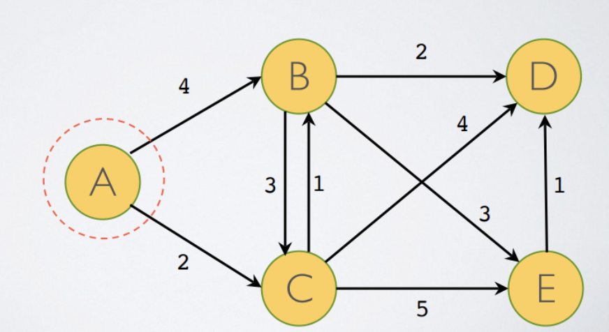

# Q1) Dijkstra's Algorithm

## Graph:

## Dijkstra's Output:

---

   HW 6:
   0) Exit

1) Dijkstras Algorithm
2) 

---

Enter menu choice: 1
Graph Info:
   Nodes: {'B', 'E', 'A', 'D', 'C'}
   Edges: defaultdict(<class 'list'>, {'A': ['B', 'C'], 'B': ['C', 'D', 'E'], 'C': ['B', 'D', 'E'], 'E': ['D']})
   Distances: {('A', 'B'): 4, ('A', 'C'): 2, ('B', 'C'): 3, ('B', 'D'): 2, ('B', 'E'): 3, ('C', 'B'): 1, ('C', 'D'): 4, ('C', 'E'): 5, ('E', 'D'): 1}

Node( A ) with Weight( 0 ) is added to the Visited( {'A'} )
    Relaxed: vertex( B ): Old ( inf ), New ( 4 ), Paths {}
    Relaxed: vertex( C ): Old ( inf ), New ( 2 ), Paths {'B': 'A'}

Node( C ) with Weight( 2 ) is added to the Visited( {'B', 'A', 'C'} )
    Relaxed: vertex( B ): Old ( 4 ), New ( 3 ), Paths {'B': 'A', 'C': 'A'}
    Relaxed: vertex( D ): Old ( inf ), New ( 6 ), Paths {'B': 'C', 'C': 'A'}
    Relaxed: vertex( E ): Old ( inf ), New ( 7 ), Paths {'B': 'C', 'C': 'A', 'D': 'C'}

Node( B ) with Weight( 3 ) is added to the Visited( {'B', 'E', 'A', 'D', 'C'} )
    No edge relaxation is needed for Node( C )
    Relaxed: vertex( D ): Old ( 6 ), New ( 5 ), Paths {'B': 'C', 'C': 'A', 'D': 'C', 'E': 'C'}
    Relaxed: vertex( E ): Old ( 7 ), New ( 6 ), Paths {'B': 'C', 'C': 'A', 'D': 'B', 'E': 'C'}

Node( D ) with Weight( 5 ) is added to the Visited( {'B', 'E', 'A', 'D', 'C'} )
    No unvisited outgoing edge from Node( D )

Node( E ) with Weight( 6 ) is added to the Visited( {'B', 'E', 'A', 'D', 'C'} )
    No edge relaxation is needed for Node( D )

Shortest Distance to Each Node:
    ({'B': 3, 'E': 6, 'A': 0, 'D': 5, 'C': 2}, {'B': 'C', 'C': 'A', 'D': 'B', 'E': 'B'})

# Q2) Application of Disjkstra's and MST Algorithms

## Distance Table:

|                   | Atlanta | Boston | Chicago | Dallas | Denver | Houston | LA   | Memphis | Miami | NY   | Philly | Phoenix | SF    | Seattle | W DC |
| ----------------- | ------- | ------ | ------- | ------ | ------ | ------- | ---- | ------- | ----- | ---- | ------ | ------- | ----- | ------- | ---- |
| **Atlanta** | 0       | 1505   |         | 1157   |        |         |      |         | 973   |      |        |         | 3434  |         |      |
| **Boston**  | 1505    | 0      | 1367    |        | 2839   |         |      |         |       | 306  |        |         |       |         |      |
| **Chicago** |         | 1367   | 0       |        | 1474   |         |      |         |       | 1145 |        | 2332    |       |         |      |
| **Dallas**  | 1157    |        |         | 0      | 1064   | 362     |      | 675     |       |      |        | 1422    |       |         | 1900 |
| **Denver**  |         | 2839   | 1474    | 1064   | 0      |         | 1335 | 1411    |       |      |        |         |       |         | 2395 |
| **Houston** |         |        |         | 362    |        | 0       | 2205 |         |       |      |        |         |       |         |      |
| **LA**      |         |        |         |        | 1335   | 2205    | 0    |         | 3755  | 3933 |        |         | 559   | 1544    |      |
| **Memphis** |         |        |         | 675    | 1411   |         |      | 0       |       |      | 1413   |         |       |         |      |
| **Miami**   | 973     |        |         |        |        |         | 3755 |         | 0     |      |        | 3182    |       |         | 1487 |
| **NY**      |         | 306    | 1145    |        |        |         | 3933 |         |       | 0    |        | 3441    |       |         |      |
| **Philly**  |         |        |         |        |        |         |      | 1413    |       |      | *0*  | 3342    |       |         | 199  |
| **Phoenix** |         |        | 2332    | 1422   |        |         |      |         | 3182  | 3441 | 3342   | *0*   |       |         |      |
| **SF**      | 3434    |        |         |        |        |         | 559  |         |       |      |        |         | *0* | 1092    |      |
| **Seattle** |         |        |         |        |        |         | 1544 |         |       |      |        |         | 1092  | *0*   |      |
| **WDC**     |         |        |         | 1900   | 2395   |         |      |         | 1487  |      | 199    |         |       |         | 0    |

## Dijsktra's Output (copied from console output):

---

   HW 6:
   0) Exit

1) Dijkstras
2) MST
3) Zip

---

Enter menu choice: 2

Node( Denver ) with Weight( 0 ) is added to the Visited( {'Denver'} )
    Relaxed: vertex( Boston ): Old ( 2839 ), New ( 2839 ), Paths {'Boston': 'Denver'}
    Relaxed: vertex( Chicago ): Old ( 1474 ), New ( 1474 ), Paths {'Boston': 'Denver', 'Chicago': 'Denver'}
    Relaxed: vertex( Dallas ): Old ( 1064 ), New ( 1064 ), Paths {'Boston': 'Denver', 'Chicago': 'Denver', 'Dallas': 'Denver'}
    Relaxed: vertex( LA ): Old ( 1335 ), New ( 1335 ), Paths {'Boston': 'Denver', 'Chicago': 'Denver', 'Dallas': 'Denver', 'LA': 'Denver'}
    Relaxed: vertex( Memphis ): Old ( 1411 ), New ( 1411 ), Paths {'Boston': 'Denver', 'Chicago': 'Denver', 'Dallas': 'Denver', 'LA': 'Denver', 'Memphis': 'Denver'}
    Relaxed: vertex( W DC ): Old ( 2395 ), New ( 2395 ), Paths {'Boston': 'Denver', 'Chicago': 'Denver', 'Dallas': 'Denver', 'LA': 'Denver', 'Memphis': 'Denver', 'W DC': 'Denver'}

Node( Dallas ) with Weight( 1064 ) is added to the Visited( {'W DC', 'LA', 'Boston', 'Memphis', 'Dallas', 'Chicago', 'Denver'} )
    Relaxed: vertex( Atlanta ): Old ( 2221 ), New ( 2221 ), Paths {'Boston': 'Denver', 'Chicago': 'Denver', 'Dallas': 'Denver', 'LA': 'Denver', 'Memphis': 'Denver', 'W DC': 'Denver', 'Atlanta': 'Dallas'}
    No edge relaxation is needed for Node( Denver )
    Relaxed: vertex( Houston ): Old ( 1426 ), New ( 1426 ), Paths {'Boston': 'Denver', 'Chicago': 'Denver', 'Dallas': 'Denver', 'LA': 'Denver', 'Memphis': 'Denver', 'W DC': 'Denver', 'Atlanta': 'Dallas', 'Houston': 'Dallas'}
    No edge relaxation is needed for Node( Memphis )
    Relaxed: vertex( Phoenix ): Old ( 2486 ), New ( 2486 ), Paths {'Boston': 'Denver', 'Chicago': 'Denver', 'Dallas': 'Denver', 'LA': 'Denver', 'Memphis': 'Denver', 'W DC': 'Denver', 'Atlanta': 'Dallas', 'Houston': 'Dallas', 'Phoenix': 'Dallas'}
    No edge relaxation is needed for Node( W DC )

Node( LA ) with Weight( 1335 ) is added to the Visited( {'W DC', 'LA', 'Boston', 'Memphis', 'Dallas', 'Chicago', 'Houston', 'Phoenix', 'Atlanta', 'Denver'} )
    No edge relaxation is needed for Node( Denver )
    No edge relaxation is needed for Node( Houston )
    Relaxed: vertex( Miami ): Old ( 5090 ), New ( 5090 ), Paths {'Boston': 'Denver', 'Chicago': 'Denver', 'Dallas': 'Denver', 'LA': 'Denver', 'Memphis': 'Denver', 'W DC': 'Denver', 'Atlanta': 'Dallas', 'Houston': 'Dallas', 'Phoenix': 'Dallas', 'Miami': 'LA'}
    Relaxed: vertex( NY ): Old ( 5268 ), New ( 5268 ), Paths {'Boston': 'Denver', 'Chicago': 'Denver', 'Dallas': 'Denver', 'LA': 'Denver', 'Memphis': 'Denver', 'W DC': 'Denver', 'Atlanta': 'Dallas', 'Houston': 'Dallas', 'Phoenix': 'Dallas', 'Miami': 'LA', 'NY': 'LA'}
    Relaxed: vertex( SF ): Old ( 1894 ), New ( 1894 ), Paths {'Boston': 'Denver', 'Chicago': 'Denver', 'Dallas': 'Denver', 'LA': 'Denver', 'Memphis': 'Denver', 'W DC': 'Denver', 'Atlanta': 'Dallas', 'Houston': 'Dallas', 'Phoenix': 'Dallas', 'Miami': 'LA', 'NY': 'LA', 'SF': 'LA'}
    Relaxed: vertex( Seattle ): Old ( 2879 ), New ( 2879 ), Paths {'Boston': 'Denver', 'Chicago': 'Denver', 'Dallas': 'Denver', 'LA': 'Denver', 'Memphis': 'Denver', 'W DC': 'Denver', 'Atlanta': 'Dallas', 'Houston': 'Dallas', 'Phoenix': 'Dallas', 'Miami': 'LA', 'NY': 'LA', 'SF': 'LA', 'Seattle': 'LA'}

Node( Memphis ) with Weight( 1411 ) is added to the Visited( {'W DC', 'Seattle', 'LA', 'Boston', 'Miami', 'NY', 'Memphis', 'Dallas', 'Chicago', 'SF', 'Houston', 'Phoenix', 'Atlanta', 'Denver'} )
    No edge relaxation is needed for Node( Dallas )
    No edge relaxation is needed for Node( Denver )
    Relaxed: vertex( Philly ): Old ( 2824 ), New ( 2824 ), Paths {'Boston': 'Denver', 'Chicago': 'Denver', 'Dallas': 'Denver', 'LA': 'Denver', 'Memphis': 'Denver', 'W DC': 'Denver', 'Atlanta': 'Dallas', 'Houston': 'Dallas', 'Phoenix': 'Dallas', 'Miami': 'LA', 'NY': 'LA', 'SF': 'LA', 'Seattle': 'LA', 'Philly': 'Memphis'}

Node( Houston ) with Weight( 1426 ) is added to the Visited( {'W DC', 'Seattle', 'LA', 'Boston', 'Miami', 'NY', 'Memphis', 'Dallas', 'Chicago', 'SF', 'Houston', 'Philly', 'Phoenix', 'Atlanta', 'Denver'} )
    No edge relaxation is needed for Node( Dallas )
    No edge relaxation is needed for Node( LA )

Node( Chicago ) with Weight( 1474 ) is added to the Visited( {'W DC', 'Seattle', 'LA', 'Boston', 'Miami', 'NY', 'Memphis', 'Dallas', 'Chicago', 'SF', 'Houston', 'Philly', 'Phoenix', 'Atlanta', 'Denver'} )
    No edge relaxation is needed for Node( Boston )
    No edge relaxation is needed for Node( Denver )
    Relaxed: vertex( NY ): Old ( 2619 ), New ( 2619 ), Paths {'Boston': 'Denver', 'Chicago': 'Denver', 'Dallas': 'Denver', 'LA': 'Denver', 'Memphis': 'Denver', 'W DC': 'Denver', 'Atlanta': 'Dallas', 'Houston': 'Dallas', 'Phoenix': 'Dallas', 'Miami': 'LA', 'NY': 'Chicago', 'SF': 'LA', 'Seattle': 'LA', 'Philly': 'Memphis'}
    No edge relaxation is needed for Node( Phoenix )

Node( SF ) with Weight( 1894 ) is added to the Visited( {'W DC', 'Seattle', 'LA', 'Boston', 'Miami', 'NY', 'Memphis', 'Dallas', 'Chicago', 'SF', 'Houston', 'Philly', 'Phoenix', 'Atlanta', 'Denver'} )
    No edge relaxation is needed for Node( Atlanta )
    No edge relaxation is needed for Node( LA )
    No edge relaxation is needed for Node( Seattle )

Node( Atlanta ) with Weight( 2221 ) is added to the Visited( {'W DC', 'Seattle', 'LA', 'Boston', 'Miami', 'NY', 'Memphis', 'Dallas', 'Chicago', 'SF', 'Houston', 'Philly', 'Phoenix', 'Atlanta', 'Denver'} )
    No edge relaxation is needed for Node( Boston )
    No edge relaxation is needed for Node( Dallas )
    Relaxed: vertex( Miami ): Old ( 3194 ), New ( 3194 ), Paths {'Boston': 'Denver', 'Chicago': 'Denver', 'Dallas': 'Denver', 'LA': 'Denver', 'Memphis': 'Denver', 'W DC': 'Denver', 'Atlanta': 'Dallas', 'Houston': 'Dallas', 'Phoenix': 'Dallas', 'Miami': 'Atlanta', 'NY': 'Chicago', 'SF': 'LA', 'Seattle': 'LA', 'Philly': 'Memphis'}
    No edge relaxation is needed for Node( SF )

Node( W DC ) with Weight( 2395 ) is added to the Visited( {'W DC', 'Seattle', 'LA', 'Boston', 'Miami', 'NY', 'Memphis', 'Dallas', 'Chicago', 'SF', 'Houston', 'Philly', 'Phoenix', 'Atlanta', 'Denver'} )
    No edge relaxation is needed for Node( Dallas )
    No edge relaxation is needed for Node( Denver )
    No edge relaxation is needed for Node( Miami )
    Relaxed: vertex( Philly ): Old ( 2594 ), New ( 2594 ), Paths {'Boston': 'Denver', 'Chicago': 'Denver', 'Dallas': 'Denver', 'LA': 'Denver', 'Memphis': 'Denver', 'W DC': 'Denver', 'Atlanta': 'Dallas', 'Houston': 'Dallas', 'Phoenix': 'Dallas', 'Miami': 'Atlanta', 'NY': 'Chicago', 'SF': 'LA', 'Seattle': 'LA', 'Philly': 'W DC'}

Node( Phoenix ) with Weight( 2486 ) is added to the Visited( {'W DC', 'Seattle', 'LA', 'Boston', 'Miami', 'NY', 'Memphis', 'Dallas', 'Chicago', 'SF', 'Houston', 'Philly', 'Phoenix', 'Atlanta', 'Denver'} )
    No edge relaxation is needed for Node( Chicago )
    No edge relaxation is needed for Node( Dallas )
    No edge relaxation is needed for Node( Miami )
    No edge relaxation is needed for Node( NY )
    No edge relaxation is needed for Node( Philly )

Node( Philly ) with Weight( 2594 ) is added to the Visited( {'W DC', 'Seattle', 'LA', 'Boston', 'Miami', 'NY', 'Memphis', 'Dallas', 'Chicago', 'SF', 'Houston', 'Philly', 'Phoenix', 'Atlanta', 'Denver'} )
    No edge relaxation is needed for Node( Memphis )
    No edge relaxation is needed for Node( Phoenix )
    No edge relaxation is needed for Node( W DC )

Node( NY ) with Weight( 2619 ) is added to the Visited( {'W DC', 'Seattle', 'LA', 'Boston', 'Miami', 'NY', 'Memphis', 'Dallas', 'Chicago', 'SF', 'Houston', 'Philly', 'Phoenix', 'Atlanta', 'Denver'} )
    No edge relaxation is needed for Node( Boston )
    No edge relaxation is needed for Node( Chicago )
    No edge relaxation is needed for Node( LA )
    No edge relaxation is needed for Node( Phoenix )

Node( Boston ) with Weight( 2839 ) is added to the Visited( {'W DC', 'Seattle', 'LA', 'Boston', 'Miami', 'NY', 'Memphis', 'Dallas', 'Chicago', 'SF', 'Houston', 'Philly', 'Phoenix', 'Atlanta', 'Denver'} )
    No edge relaxation is needed for Node( Atlanta )
    No edge relaxation is needed for Node( Chicago )
    No edge relaxation is needed for Node( Denver )
    No edge relaxation is needed for Node( NY )

Node( Seattle ) with Weight( 2879 ) is added to the Visited( {'W DC', 'Seattle', 'LA', 'Boston', 'Miami', 'NY', 'Memphis', 'Dallas', 'Chicago', 'SF', 'Houston', 'Philly', 'Phoenix', 'Atlanta', 'Denver'} )
    No edge relaxation is needed for Node( LA )
    No edge relaxation is needed for Node( SF )

Node( Miami ) with Weight( 3194 ) is added to the Visited( {'W DC', 'Seattle', 'LA', 'Boston', 'Miami', 'NY', 'Memphis', 'Dallas', 'Chicago', 'SF', 'Houston', 'Philly', 'Phoenix', 'Atlanta', 'Denver'} )
    No edge relaxation is needed for Node( Atlanta )
    No edge relaxation is needed for Node( LA )
    No edge relaxation is needed for Node( Phoenix )
    No edge relaxation is needed for Node( W DC )

### Distances from Denver to each location with path (copied from console output).

Distances from Denver to each location:
   Denver ->    Dallas: 1064
   Denver ->    Chicago ->    NY: 2619
   Denver ->    Chicago: 1474
   Denver ->    Boston: 2839
   Denver ->    Dallas ->    Atlanta: 2221
   Denver ->    W DC ->    Philly: 2594
   Denver ->    Dallas ->    Atlanta ->    Miami: 3194
   Denver ->    Dallas ->    Phoenix: 2486
   Denver ->    LA ->    Seattle: 2879
   Denver ->    LA ->    SF: 1894
   Denver ->    W DC: 2395
   Denver ->    Memphis: 1411
   Denver ->    LA: 1335
   Denver ->    Dallas ->    Houston: 1426

## MST Output (copied from console output):

Denver is selected. Distance: 0
Dallas is selected. Distance: 1064
Houston is selected. Distance: 362
Memphis is selected. Distance: 675
Atlanta is selected. Distance: 1157
Miami is selected. Distance: 973
LA is selected. Distance: 1335
SF is selected. Distance: 559
Seattle is selected. Distance: 1092
Philly is selected. Distance: 1413
W DC is selected. Distance: 199
Phoenix is selected. Distance: 1422
Chicago is selected. Distance: 1474
NY is selected. Distance: 1145
Boston is selected. Distance: 306

Departure: Arrival:                    Weight

Denver     Dallas  .................... 1064
Dallas     Houston .................... 362
Dallas     Memphis .................... 675
Dallas     Atlanta .................... 1157
Atlanta    Miami   .................... 973
Denver     LA      .................... 1335
LA         SF      .................... 559
SF         Seattle .................... 1092
Memphis    Philly  .................... 1413
Philly     W DC    .................... 199
Dallas     Phoenix .................... 1422
Denver     Chicago .................... 1474
Chicago    NY      .................... 1145
NY         Boston  .................... 306

# Q3

## Input Text File

## Output Text File

## File Sizes

## Console Output

---

   HW 6:
   0) Exit

1) Dijkstras
2) MST
3) Zip

---

Enter menu choice: 3
Character            Frequency            Huffman Code
' '                  99                   100
'e'                  90                   010
'a'                  36                   0000
'i'                  56                   1100
'o'                  40                   0010
'r'                  53                   1011
's'                  43                   0110
't'                  50                   1010
'c'                  32                   11110
'h'                  24                   01111
'l'                  28                   11010
'm'                  20                   00011
'n'                  35                   11111
'u'                  21                   00111
','                  10                   000100
'd'                  16                   111011
'g'                  10                   001100
'p'                  15                   110111
'v'                  11                   011100
'.'                  5                    0001010
'D'                  5                    0001011
'M'                  7                    1101101
'S'                  6                    0111010
'b'                  8                    1110100
'f'                  6                    0111011
'k'                  5                    0011010
'w'                  6                    1101100
'y'                  8                    1110101
'\n'                 4                    11100000
'-'                  4                    11100010
'A'                  3                    00110110
'I'                  3                    00110111
':'                  2                    111000110
'C'                  2                    111000111
'O'                  2                    111001001
'T'                  2                    111001010
'W'                  2                    111001100
'z'                  2                    111001101
'“'                  2                    111001110
'”'                  2                    111001111
'&'                  1                    1110000100
'('                  1                    1110000101
')'                  1                    1110000110
'B'                  1                    1110000111
'H'                  1                    1110010000
'P'                  1                    1110010001
'V'                  1                    1110010110
'x'                  1                    1110010111

Expected Huffman cost: 3579

Expected ASCII cost: 6264
Huffman efficiency over ASCII:  75.02%

Expected FCL cost: 4698
Huffman efficiency over FCL:  23.82%
Original file size: 791
Zipped file size: 448
Unzipped file size: 791
